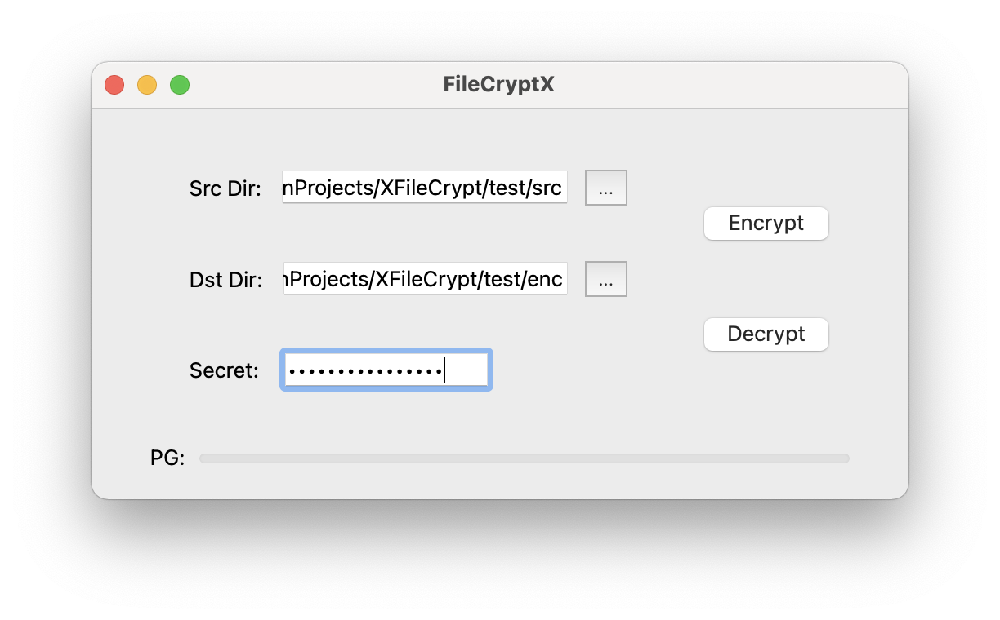

<!-- PROJECT SHIELDS -->
[![Contributors][contributors-shield]][contributors-url]
[![Forks][forks-shield]][forks-url]
[![Stargazers][stars-shield]][stars-url]
[![Issues][issues-shield]][issues-url]
[![License][license-shield]][license-url]

[//]: # "[![Build][build-shield]][build-url]"

<!-- PROJECT LOGO -->
 

<h3 align="center">FileCryptX</h3>

  

    XFileCrypt GUI base on Qt6
     
    <a href="https://github.com/hominsu/FileCryptX"><strong>Explore the docs »</strong></a>
     
     
    <a href="https://github.com/hominsu/FileCryptX">View Demo</a>
    ·
    <a href="https://github.com/hominsu/FileCryptX/issues">Report Bug</a>
    ·
    <a href="https://github.com/hominsu/FileCryptX/issues">Request Feature</a>
  

## Description

基于我的设计的[多线程文件加密程序](https://github.com/hominsu/XFileCrypt)并使用 Qt6 完成的 GUI。

- 加密演示

- 解密演示

- 解密文件展示

<!-- MARKDOWN LINKS & IMAGES -->
<!-- https://www.markdownguide.org/basic-syntax/#reference-style-links -->

[contributors-shield]: https://img.shields.io/github/contributors/hominsu/FileCryptX.svg?style=for-the-badge
[contributors-url]: https://github.com/hominsu/FileCryptX/graphs/contributors
[forks-shield]: https://img.shields.io/github/forks/hominsu/FileCryptX.svg?style=for-the-badge
[forks-url]: https://github.com/hominsu/FileCryptX/network/members
[stars-shield]: https://img.shields.io/github/stars/hominsu/FileCryptX.svg?style=for-the-badge
[stars-url]: https://github.com/hominsu/FileCryptX/stargazers
[issues-shield]: https://img.shields.io/github/issues/hominsu/FileCryptX.svg?style=for-the-badge
[issues-url]: https://github.com/hominsu/FileCryptX/issues
[license-shield]: https://img.shields.io/github/license/hominsu/FileCryptX.svg?style=for-the-badge
[license-url]: https://github.com/hominsu/FileCryptX/blob/master/LICENSE
[build-shield]: https://img.shields.io/github/workflow/status/hominsu/FileCryptX/Build%20Test?style=for-the-badge
[build-url]: https://github.com/hominsu/FileCryptX/actions/workflows/build-test.yml

